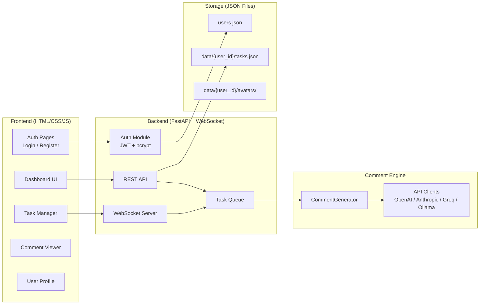

# 🗨️ Social Media Comment Generator — Web App

Biến công cụ sinh comment CLI hiện tại thành một ứng dụng web hoàn chỉnh với giao diện đẹp, hệ thống tài khoản, hỗ trợ chạy song song nhiều task và theo dõi tiến trình thời gian thực.

## Kiến trúc tổng thể



---

## Proposed Changes

### 1. Hệ thống tài khoản (Authentication)

#### [NEW] [`auth.py`](file:///d:/VSCODE/cmt%20-%20Copy/auth.py)

Module xác thực người dùng, quản lý tài khoản:

- **Lưu trữ**: JSON file (`data/users.json`) — mỗi user là 1 object:
  ```json
  {
    "user_id": "uuid-8-chars",
    "username": "johndoe",
    "email": "john@example.com",
    "display_name": "John Doe",
    "password_hash": "$2b$12$...",
    "avatar_path": "data/avatars/abc123.png",
    "created_at": "2026-09-03T10:00:00",
    "last_login": "2026-09-03T10:00:00"
  }
  ```
- **Mật khẩu**: Băm bằng `bcrypt` (thư viện `passlib`) — không bao giờ lưu plaintext
- **JWT Token**: Sau đăng nhập, server trả về JWT token (thư viện `python-jose`), frontend lưu vào `localStorage` và gửi kèm mỗi request qua header `Authorization: Bearer <token>`
- **Token expiry**: 24 giờ, tự động logout khi hết hạn
- **Avatar**: Upload file ảnh, lưu vào `data/avatars/`, resize xuống 200×200px bằng Pillow

#### Auth API Endpoints (tích hợp vào `server.py`):

| Method | Endpoint | Mô tả |
|--------|----------|-------|
| `POST` | `/api/auth/register` | Đăng ký (username, email, password, display_name) |
| `POST` | `/api/auth/login` | Đăng nhập → trả JWT token |
| `GET` | `/api/auth/me` | Lấy thông tin user hiện tại (từ token) |
| `PUT` | `/api/auth/me` | Cập nhật profile (display_name, email) |
| `PUT` | `/api/auth/me/password` | Đổi mật khẩu |
| `POST` | `/api/auth/me/avatar` | Upload avatar |

#### Phân tách dữ liệu theo user:
- Mỗi user có thư mục riêng: `data/{user_id}/`
- Task và comment của user A không nhìn thấy được bởi user B
- Tất cả API task (`/api/tasks/*`) tự động lọc theo user đang đăng nhập

---

### 2. Frontend — Trang đăng nhập / đăng ký

#### [NEW] `frontend/auth.html`

Trang xác thực riêng biệt, gồm 2 tab chuyển đổi mượt mà:

**Tab Đăng nhập:**
| Field | Validation |
|-------|-----------|
| Username hoặc Email | Bắt buộc |
| Mật khẩu | Bắt buộc, tối thiểu 6 ký tự |
| Nút "Đăng nhập" | Gửi POST `/api/auth/login` |
| Link "Chưa có tài khoản? Đăng ký" | Chuyển sang tab Register |

**Tab Đăng ký:**
| Field | Validation |
|-------|-----------|
| Tên hiển thị | Bắt buộc, 2–30 ký tự |
| Username | Bắt buộc, 3–20 ký tự, chỉ chữ/số/underscore |
| Email | Bắt buộc, format email hợp lệ |
| Mật khẩu | Bắt buộc, tối thiểu 6 ký tự |
| Xác nhận mật khẩu | Phải trùng khớp |
| Upload Avatar | Tuỳ chọn, preview ảnh tròn trước khi upload |
| Nút "Tạo tài khoản" | Gửi POST `/api/auth/register` |

**Thiết kế:**
- Centered card trên nền gradient tím-xanh animated
- Glassmorphism card với blur effect
- Chuyển tab Login ↔ Register bằng slide animation
- Hiển thị lỗi inline (username đã tồn tại, sai mật khẩu...) với shake animation
- Logo + tagline ở phía trên form

#### [NEW] `frontend/auth.js`

Logic xử lý xác thực phía frontend:
- **AuthManager class**: Quản lý login, register, logout, token refresh
- Lưu JWT token vào `localStorage`
- Tự động redirect về `auth.html` nếu token hết hạn hoặc chưa đăng nhập
- Gắn token vào mọi API request qua `fetch` wrapper

---

### 3. Backend — FastAPI Server

#### [NEW] [`server.py`](file:///d:/VSCODE/cmt%20-%20Copy/server.py)

Máy chủ FastAPI phục vụ cả API lẫn frontend tĩnh:

- **Auth Middleware**: Kiểm tra JWT token ở mọi endpoint `/api/tasks/*`. Trả 401 nếu không hợp lệ.

- **Task REST Endpoints** (yêu cầu đăng nhập):
  | Method | Endpoint | Mô tả |
  |--------|----------|-------|
  | `POST` | `/api/tasks` | Tạo task mới (nhận config: topic, provider, model, count...) |
  | `GET` | `/api/tasks` | Lấy danh sách task **của user đang đăng nhập** |
  | `GET` | `/api/tasks/{id}` | Lấy chi tiết 1 task (kiểm tra quyền sở hữu) |
  | `DELETE` | `/api/tasks/{id}` | Huỷ / xoá task |
  | `GET` | `/api/tasks/{id}/download?format=json` | Tải kết quả (JSON hoặc CSV) |
  | `GET` | `/api/tasks/{id}/comments` | Lấy danh sách comment với filter |
  | `GET` | `/api/providers` | Lấy danh sách providers + models có sẵn |

- **WebSocket** (`/ws/tasks/{id}`): Stream real-time tiến trình (xác thực qua query param `?token=...`)

- **Task Queue**: Dùng `asyncio` + `threading` để chạy song song nhiều task. Mỗi task gắn `user_id` để phân tách dữ liệu.

---

#### [MODIFY] [`generate_comments.py`](file:///d:/VSCODE/cmt%20-%20Copy/generate_comments.py)

Refactor nhẹ class `CommentGenerator` để hỗ trợ chế độ callback:

- Thêm tham số `on_progress(batch_num, total, new_comments, log_message)` callback vào phương thức `run()`
- Thêm cơ chế `cancel_flag` để có thể huỷ task đang chạy giữa chừng
- Giữ nguyên toàn bộ logic hiện tại, chỉ bọc thêm lớp callback

---

#### [MODIFY] [`requirements.txt`](file:///d:/VSCODE/cmt%20-%20Copy/requirements.txt)

```diff
 openai>=1.0.0
 anthropic>=0.20.0
+fastapi>=0.110.0
+uvicorn[standard]>=0.27.0
+websockets>=12.0
+python-jose[cryptography]>=3.3.0
+passlib[bcrypt]>=1.7.4
+python-multipart>=0.0.6
```

---

### 4. Frontend — Dashboard (sau khi đăng nhập)

#### [NEW] `frontend/index.html`

Trang SPA chính, gồm:

1. **Header**: Logo + tiêu đề + **User menu** (avatar tròn + display name, dropdown: Profile / Đổi mật khẩu / Logout)
2. **Sidebar trái**: Danh sách task đang chạy và đã hoàn thành (task cards)
3. **Main area**: Tuỳ trạng thái hiện tại:
   - *Tạo task mới*: Form cấu hình
   - *Xem task đang chạy*: Progress bar + real-time log + comment stream
   - *Xem kết quả*: Bảng dữ liệu comment + filter + nút tải

#### [NEW] `frontend/style.css`

- **Theme**: Dark mode chủ đạo, gradient tím-xanh dương, glassmorphism cards
- **Responsive**: Desktop + mobile
- **Animations**: Smooth transitions, pulse progress bar, fade-in comments
- **Typography**: Google Font "Inter"
- **Color palette**:
  - Background: `#0a0a1a` → `#1a1a2e`
  - Cards: `rgba(255,255,255,0.05)` + `backdrop-filter: blur()`
  - Accent: `#7c3aed` → `#06b6d4` gradient
  - Text: `#e2e8f0` / `#94a3b8`
  - Success `#10b981` / Error `#ef4444` / Warning `#f59e0b`

#### [NEW] `frontend/app.js`

- **TaskManager class**: CRUD task qua REST API (tự gắn auth token)
- **WebSocketManager class**: Real-time progress
- **UIRenderer**: Render task list, config form, comment table, stats charts
- **FilterEngine**: Lọc comment theo tone, style, từ khoá
- **UserMenu**: Hiển thị avatar + dropdown profile/logout

---

### 5. Tính năng chi tiết trên giao diện

#### 🔐 Luồng xác thực
1. User mở web → kiểm tra token trong `localStorage`
2. Không có token / token hết hạn → redirect sang `auth.html`
3. Đăng nhập thành công → lưu token, redirect về `index.html` (dashboard)
4. Mọi API call gắn `Authorization: Bearer <token>`
5. Click Logout → xoá token, redirect về `auth.html`

#### 🆕 Tạo task mới (Form)
| Field | Loại | Ghi chú |
|-------|------|---------|
| Chủ đề | Text input | Bắt buộc |
| Số lượng comment | Number slider (10–1000) | Mặc định 200 |
| Ngôn ngữ | Dropdown | Tiếng Việt, English... |
| AI Provider | Dropdown | OpenAI, Anthropic, Groq, Ollama |
| Model | Dropdown (thay đổi theo provider) | Auto-suggest |
| Batch size | Number input | Mặc định 15 |
| Ngưỡng trùng lặp | Range slider (0–1) | Mặc định 0.75 |

#### 📊 Theo dõi task đang chạy
- Animated progress bar (% hoàn thành)
- Log panel cuộn tự động — "Batch 3: Nhận 15 → Trùng 2 → Thêm 13"
- Comment mới xuất hiện real-time (fade-in)
- Nút **Huỷ task** (đỏ)

#### 📋 Xem kết quả & Quản lý comment
- Bảng phân trang: #, Content, Tone, Style, Words
- Filter: tone chips, style dropdown, text search
- Donut chart CSS thuần — phân bố tone, style, độ dài
- Download JSON / CSV
- Copy comment khi click

#### 👤 User Profile
- Xem & sửa display name, email
- Đổi mật khẩu
- Đổi avatar (upload mới, preview)

---

## Cấu trúc thư mục sau khi hoàn thành

```
cmt - Copy/
├── server.py                    ← [NEW] FastAPI server + auth endpoints
├── auth.py                      ← [NEW] Auth module (JWT, bcrypt, user CRUD)
├── generate_comments.py         ← [MODIFIED] Thêm callback + cancel
├── config.json                  ← Giữ nguyên
├── requirements.txt             ← [MODIFIED] Thêm dependencies
├── README.md                    ← [MODIFIED] Thêm hướng dẫn chạy web
├── frontend/                    ← [NEW] Thư mục frontend
│   ├── auth.html                ← Trang đăng nhập / đăng ký
│   ├── auth.js                  ← Logic xác thực frontend
│   ├── index.html               ← Dashboard chính (sau đăng nhập)
│   ├── style.css                ← CSS chung (auth + dashboard)
│   └── app.js                   ← Logic dashboard
├── data/                        ← [NEW] Dữ liệu runtime
│   ├── users.json               ← Danh sách tài khoản
│   └── {user_id}/               ← Thư mục riêng mỗi user
│       ├── tasks.json
│       └── avatars/
└── output/                      ← Giữ nguyên (kết quả cũ từ CLI)
```

---

## Verification Plan

### Automated Tests
```bash
cd "d:\VSCODE\cmt - Copy"
pip install -r requirements.txt
python -c "import uvicorn, jose, passlib; print('Dependencies OK')"

# Chạy server
python server.py
# → Mở http://localhost:8000 trên trình duyệt
```

### Manual Verification
- Đăng ký tài khoản mới → kiểm tra validation (username trùng, email sai format...)
- Đăng nhập → xác nhận redirect về dashboard
- Tạo task sinh 5–10 comment → xem progress real-time
- Đăng nhập tài khoản khác → xác nhận không thấy task của user trước
- Kiểm tra filter, search, download file
- Thử đổi avatar, đổi mật khẩu
- Kiểm tra tạo nhiều task song song

> [!IMPORTANT]
> Để chạy được, bạn cần có ít nhất 1 API key đã được thiết lập (ví dụ `GROQ_API_KEY` theo config hiện tại). Giao diện web sẽ hiển thị và hoạt động bình thường, nhưng việc **sinh comment thực tế** phụ thuộc vào API key hợp lệ.
